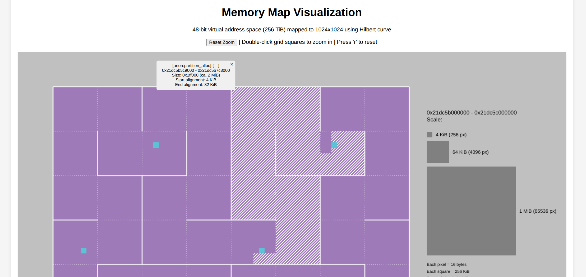

# Memory Map Generator

A vibe-coded node utility that takes a list of virtual memory regions and plots them on a
zoomable canvas in your browser.

The Hilbert curve is used to map addresses to pixels, so that any consecutive area is connected in the image.  Resolution is 1 pixel = 64Mbytes.  Tuned to the 47 bit user-space available on Linux.

Understands its own format, but can also read the format of /proc/pid/maps.

For example, use 'top' to find an active Chrome process then start the server on
localhost:8080 with:

```
make install
node index.js /proc/123/maps
```


